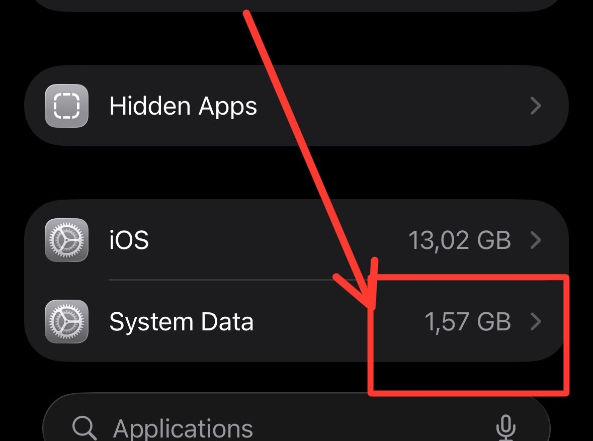

I've been struggling with System Data on my iPhone taking up all the storage. I tried many solutions, including [this discussion thread](https://discussions.apple.com/thread/254876478?sortBy=rank), but nothing worked.

Finally, I found a solution that reduced my System Data from 17GB to 1.57GB!

<!-- truncate -->



**Please note: Do this at your own risk.**

## Steps

### 1. Install libimobiledevice

[libimobiledevice](https://libimobiledevice.org/) is a cross-platform FOSS library written in C to communicate with iOS devices natively.

Visit the [installation guide](https://libimobiledevice.org/#get-started) for more details.

On macOS, you can install it using Homebrew:

```bash
brew install libimobiledevice
```

Or build from source for the newest version:

```bash
mkdir -p limd-build
cd limd-build
curl -Ls -o limd-build-macos.sh https://is.gd/limdmacos
bash ./limd-build-macos.sh
```

### 2. Plug in your iPhone

Connect your iPhone to your computer, unlock it, and trust the computer when prompted.

### 3. Restart to trigger cleanup thread

Run the following command to restart your iPhone:

```bash
idevicediagnostics restart
```

That's it! After your iPhone restarts, it will take a while to finish the cleanup process. Give it 2-3 minutes, then check iPhone Storage again. You'll be surprised to see how much storage has been freed up.
